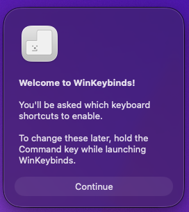
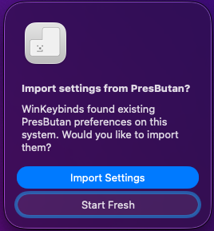
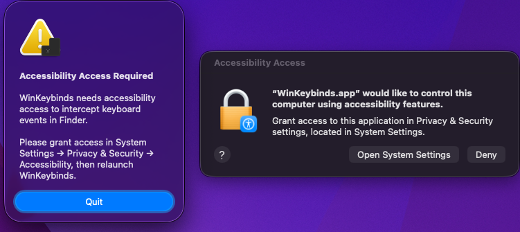

# WinKeybinds

WinKeybinds is a native Apple Silicon reimplementation of
[PresButan](https://briankendall.net/presButan/index.htm) by Brian Kendall, a
simple macOS utility adding Windows-style keyboard shortcuts to Finder that had
not been updated since 2012. WinKeybinds was built from scratch using Claude
Code with Opus 4.6 and based on reverse-engineering of the original binary. No
original PresButan source code was used.

## What it does

- **Return / Enter** opens selected items in Finder (like double-click)
- **Delete / Forward Delete** moves selected items to the Trash
- Each key can be individually enabled or disabled
- Runs silently in the background with no Dock icon or menu bar
- Supports importing settings from the original PresButan
- **Ctrl+Cmd+Delete** quits the app

## Install

Download `WinKeybinds.app` from
[Releases](../../releases) and move it to `/Applications`.

Since the app is not notarized, macOS will block it on first launch.
Right-click the app and choose **Open**, then click **Open** in the dialog.
This only needs to be done once.

## Requirements

- Apple Silicon Mac
- macOS 13.0+
- Accessibility permission (prompted on first launch)

## Configuration

On first launch, WinKeybinds walks you through a series of dialogs to
configure which keys to enable:



If you have the original PresButan installed, WinKeybinds will offer to import
your existing settings:



To reconfigure later, hold the **Command** key while launching the app.

## Permissions

WinKeybinds requires Accessibility access to intercept keyboard events in
Finder. You'll be prompted to grant this on first launch:



## Quitting

WinKeybinds runs invisibly — no Dock icon, no menu bar. To quit it, press
**Ctrl+Cmd+Delete** in Finder, or use Activity Monitor.

## Building

Open `WinKeybinds.xcodeproj` in Xcode and build, or from the command line:

```
xcodebuild -scheme WinKeybinds -configuration Release build
```

## Third-Party Assets

### App Icon
- **Enter key shape**: Based on assets from [Mr. Breakfast's Free Prompts](https://github.com/mr-breakfast/mrbreakfasts_free_prompts) (CC0 1.0 - Public Domain)
- **Windows logo**: From [Bootstrap Icons](https://github.com/twbs/icons) (MIT License, Copyright 2019-2024 The Bootstrap Authors)

## License

MIT License. See [LICENSE](LICENSE) for details.
